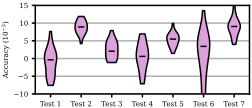

# Minimal single-panel Python violin plot recipe

Create clean, publication-ready violin plots comparing distributions across multiple methods or datasets, without fighting Matplotlib defaults.
This deliberately simple figure recipe produces a single, high-quality panel that imports cleanly into LaTeX and Microsoft Word.
It is optimized for single-column figure panels in two-column journal and conference papers.
An extended version addresses grouped method comparisons across multiple datasets or conditions, with explicit coloring and a dedicated legend.


## Preview




## Scope of this example

This repository demonstrates:

- a single-panel violin plot
- comparison across multiple methods or datasets
- explicit, readable Matplotlib code without additional frameworks
- sizing optimized for single-column figures in two-column papers
- clean defaults suitable for publication output

The goal is to provide a minimal, transparent starting point with sensible spacing, stroke widths, and labels that can be adapted as needed.


## Quick start

Install dependencies:
```sh
pip install matplotlib numpy
```

Run the example:
```sh
python recipe.py
```

This generates a single-panel violin plot (`figure.pdf`) from example data.


## Extended recipe

The example is part of a more general [Python recipe](https://cells.gumroad.com/l/violin-single-panel) for comparisons of grouped methods across multiple datasets or conditions.
The extended recipe builds directly on this repository and includes:

- grouped method comparisons across multiple datasets
- easy control over inter-group spacing
- a legend with consistent coloring across violins
- LaTeX layout examples and embedding snippets
